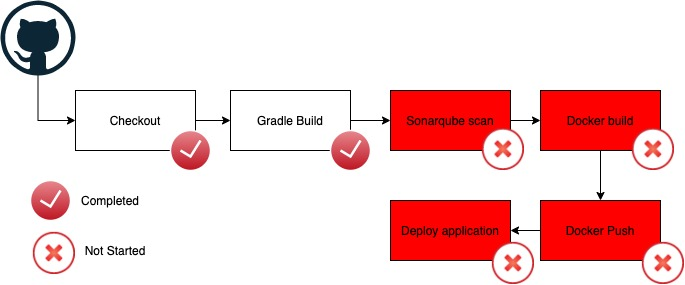

# Welcome to the DevOps Warrior team!

You have been brought into a scenario where our entire DevOps team just vanished over night. ~~We suspect it could be an alien abduction, since some of our engineers brought up UFO sightings in the stand-ups last week~~ (_Needs peer review_).

### Our Goal

We are planning for the big release of our **Hello World Application** by end of the day

Our DevOps team was working day and night to get this application onto the CICD pipeline but, unfortunately they couldnt complete it, which is where you come in!

### Onboard the our flagship application onto the CICD pipeline

**Status:** In-progress

**Application Code:** https://github.com/DevOpsTestLab/sample-spring-boot

**Description:** 

The DevOps team picked up this work as part of the CICD onboarding but, unfortunately they couldn't complete it.

Below is the block diagram of how the pipeline should look like. _The blocks in RED needs your attention._

## Below is the list of tasks where your help is required:

### Task 1: Spin-up our CICD infrastructure

> Description: We will be using Jenkins as our CICD tool. Here is the link to our Jenkins repo, https://github.com/DevOpsTestLab/jenkins. 
You should see a `kubernetes.yml` files which you can deploy on your local minikube version.

> **Username and password for this instance is: `admin` and `admin`**

> **Note**: Based on the latest update we have from our DevOps team(Before they vanished), this instance may not be fully ready, we know it spins up successfully.However, you may still have to modify any configuration, install plugins, create new configurations, add credentials to support our new onboarding initiative.

***

### Task 2: Setup a new multi-branch pipeline job for our hello world app

> Description: Here is our flagship application which needs to be onboarded, https://github.com/DevOpsTestLab/sample-spring-boot. Fork this repository under your own github account so that you can work on it independently. You should see the `Jenkinfile` as part of the repository which our DevOps team created. Its developed in springboot and gradle is used as the build automation tool. Create a multi-branch pipeline project in our Jenkins instance and confirm that the build is successful.

> **Note**: Feel free to install any plugin in Jenkins to make this work. Set-up GITHUB credentials in Jenkins so that it can checkout and perform the build.

***

### Task 3: Setup sonarqube scan for this project

> Description: We would like to get visibility on our code quality. Please integrate sonarqube in our pipeline. Here are the details below of our sonarqube server, https://sonarcloud.io/. Please integrate your GITHUB account with sonarcloud and create an organization. Update the `Jenkinsfile` to include a new stage called `sonarqube` and add the logic to scan the project. You may have already seen that the devops team has used [docker pipeline](https://www.jenkins.io/doc/book/pipeline/docker/) to use docker containers as our execution environment. Please stick to the same approach if possible.

> **Note**: Please make sure that you dont interfere with the ongoing development on the master branch. Follow branching and merging strategies as much as possible. The multi-branch pipeline will spin up automated jobs for each new branch you create. Feel free to look up in dockerhub for any docker images that you can find to use as the execution environment.

> Here are some useful links, 
- https://sonarcloud.io/documentation/analysis/analysis-parameters/
- https://docs.sonarqube.org/latest/analysis/scan/sonarscanner-for-jenkins/

***

### Task 3: Setup docker build and docker push

> Description: Based on the latest update from the DevOps team, one of the engineers was "working" on containerzing the application. You should see a `Dockerfile` in the repo. We were told that the docker build was failing with the `COPY` step, troubleshoot the same and integrat it in the pipeline. Add a new stage for docker build and docker push to the docker hub. You may have already seen that the devops team has used [docker pipeline](https://www.jenkins.io/doc/book/pipeline/docker/) to use docker containers as our execution environment. Please stick to the same approach if possible.

> **Note**: Please make sure to not interfere with the ongoing development on the master branch. Follow branching and merging strategies as much as possible. The multi-branch pipeline will spin up automated jobs for each new branch you create. Feel free to look up in dockerhub for any docker images that you can find to use as the execution environment. You can use your personal credentials to perform the docker push from Jenkins. Make sure to not put your credentials in clear text. Tag the docker images along with the Jenkins build number. Feel free to install any plugins as required.

