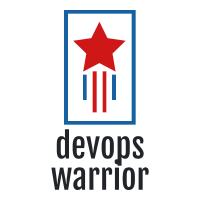

# Welcome to the DevOps Warrior team!

You have been brought into a scenario where our entire DevOps team just vanished over night. ~~We suspect it could be an alien abduction, since some of our engineers brought up UFO sightings in the stand-ups last week~~ (_Needs peer review_).

### About our Application

We are planning for the big release of our **Hello World Application** by end of the day

Our DevOps team was working day and night to get this application onto the CICD pipeline but, unfortunately they couldnt complete it, which is where you come in!

### Onboard the our flagship application onto the CICD pipeline

**Status:** In-progress

**Application Code:** https://github.com/DevOpsTestLab/sample-spring-boot

**Description:** 

The DevOps team picked up this work as part of the CICD onboarding but, unfortunately they couldn't complete it.

Below is the block diagram of how the pipeline should look like. _The blocks in RED needs your attention._

## Below is the list of tasks where your help is required:

### Task 1: Spin-up our CICD infrastructure

Description: We will be using Jenkins as our CICD tool. Here is the link to our Jenkins repo, https://github.com/DevOpsTestLab/jenkins. 
You should see a `kubernetes.yml` files which you can deploy on your local minikube version.

**Username and password to this instance is: `admin` and `admin`**

**Note**: Based on the latest update we have from our DevOps team(Before they vanished), this instance may not be fully ready, we know it spins up successfully.However, you may still have to modify any configuration, install plugins, create new configurations, add credentials to support our new onboarding initiative.

### Task 2: Spin-up our CICD infrastructure

Description: We will be using Jenkins as our CICD tool. Here is the link to our Jenkins repo, https://github.com/DevOpsTestLab/jenkins. 
You should see a `kubernetes.yml` files which you can deploy on your local minikube version.

**Username and password to this instance is: `admin` and `admin`**

**Note**: Based on the latest update we have from our DevOps team(Before they vanished), this instance may not be fully ready, we know it spins up successfully.However, you may still have to modify any configuration, install plugins, create new configurations, add credentials to support our new onboarding initiative.

### About our Customer
This application will be targetted to our customers all around the globe who desperately need to be greeted with a **Hello**, specially during these tough times!

